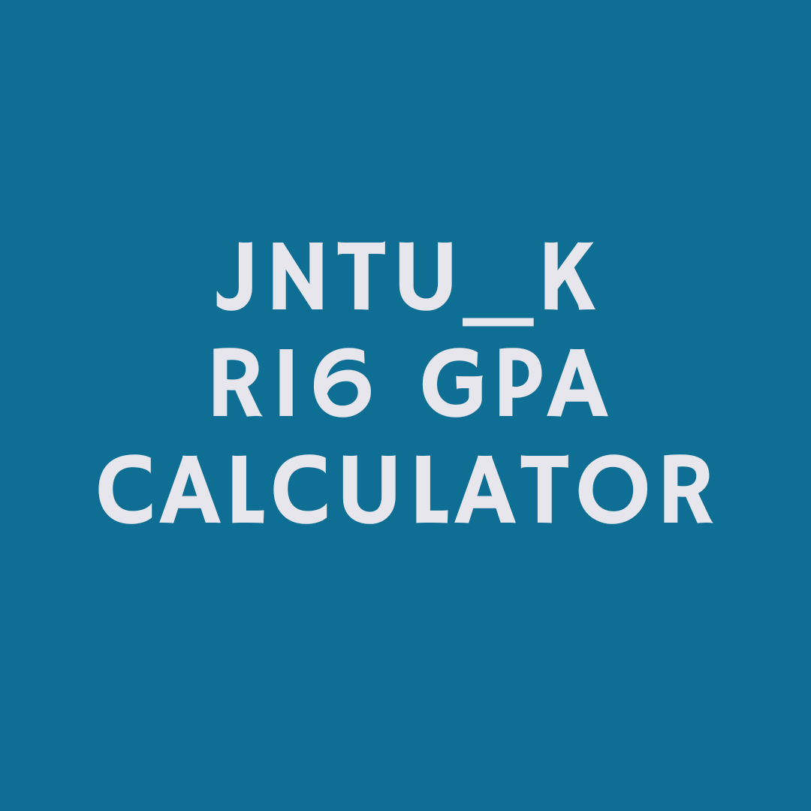
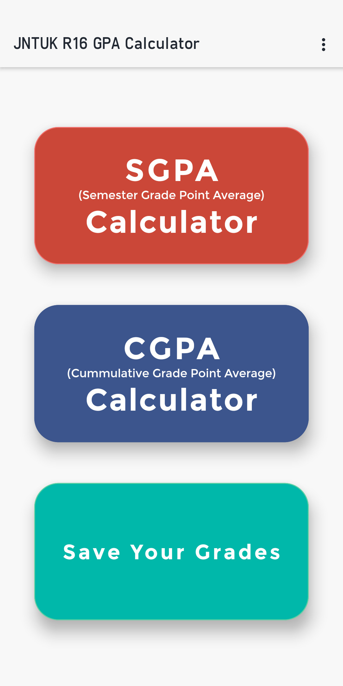
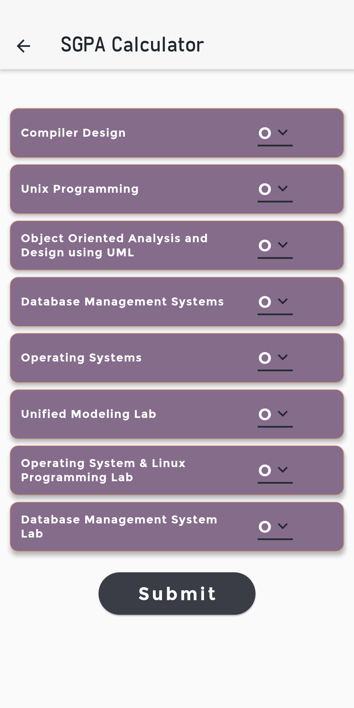
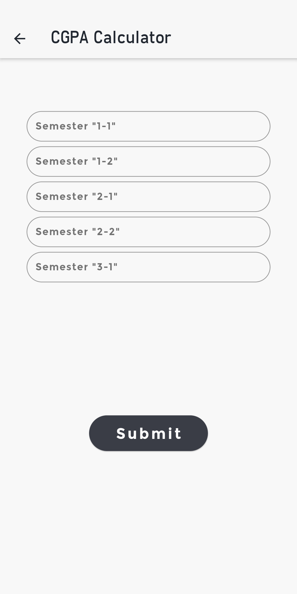
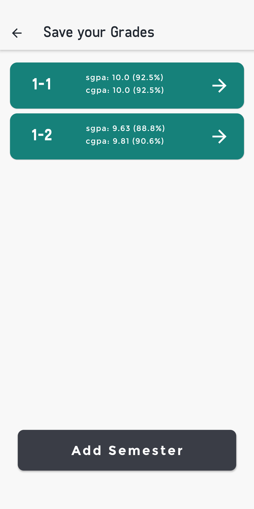

# jntuk R16 GPA calculator -Android App

It is Free and doesnot require any permissions.

It is Developed in Dart Language and Flutter Framework.

 
 This app is not published on play store but you can be <a href = "https://drive.google.com/file/d/1MWtU4xYmJ6egpj1zU4L4D0aSi7fpRMel/view">
  Download</a>
   it from here. 

## About

JntuK R16 GPA Calculator is made to calculate Sgpa and Cgpa of a JntuK R16 student of BTech Degree and selected Branches.

This android application is also helpful in storing and accessing the grades of a student easily.

This application was originally developed by Badari Narayana Maddali.

## Features

This android application lets you:

- Calculate Sgpa for any of the semesters in specific branches.
- Caclulate Cgpa for all the semesters until Current Semester.
- Can save your grades until the Current Semester.
- Supports Android version of 8 and Above.
- An add-free application.

## Screenshots

## Permissions

This Android application does not require any special permissions.

## Packages Used

- sqflite : https://pub.dev/packages/sqflite
- fluttertoast : https://pub.dev/packages/fluttertoast
- auto-size-text : https://pub.dev/packages/auto_size_text
- path_provider : https://pub.dev/packages/path_provider
